# NuImages Multiclass Object Detection & Classification

> A computer vision project for multiclass object classification using the [NuImages dataset](https://www.nuscenes.org/nuimages).

---

## Project Overview

This project focuses on **multiclass object classification** using the **NuImages dataset**, a comprehensive street-view image dataset captured in cities like Boston and Singapore. The dataset is ideal for autonomous vehicle-related computer vision tasks.

We reduced the original 23 classes to **10 canonical classes** for simplified training and evaluation.

1. Car  
2. Barrier  
3. Truck  
4. Pedestrian  
5. Traffic cone  
6. Motorcycle  
7. Bicycle  
8. Bus  
9. Construction vehicle  
10. Trailer

---

## Data Preprocessing & Quality Analysis Pipeline

- **Overlap Detection**: Flag objects with IoU > 0.15 (same class) or IoA > 0.15 (different classes)
- **Mislabeling Detection**: Identify significant overlap between different classes
- **Distribution Analysis**: Analyze class distribution across cameras and group vs single instances
- **High IoA different class**: Objects from different classes heavily overlap (potential mislabeling)
- **High IoU**: Same class objects overlap significantly (potential duplicate crops)
- **Both issues**: Combined overlap problems

This preprocessing ensures clean training data by identifying mislabeled or overlapping crops that could confuse the multiclass classifier, particularly for classes like traffic cones and barriers that frequently appear in groups.

The final dataset, metadata (manifest.csv and classes.json) can be found in Kaggle: [Processed NuImages Dataset](https://www.kaggle.com/datasets/ziqiangg/nuimages)

---

## Experimentation

To view the studies below in more detail, please navigate to /experiments to view the notebooks for the ablation or loss comparison study.

### Ablation Study
This ablation study evaluates the performance contribution of the pretrained ResNet50 feature extractor versus the classifier component. By freezing the entire backbone and training only the final classifier, we isolate whether ImageNet-pretrained features alone are sufficient for NuImages classification or if fine-tuning the backbone is necessary.

#### Model Specifications

- **Input tensor**: (batch_size, 3, 224, 224)
- **Pretrained backbone**: ResNet50 with ImageNet1K_V1 weights
- **Freezing strategy**: Complete backbone frozen, only final classifier trainable

#### Feature Extractor

- **ResNet50 Backbone**: All layers frozen (conv1 through layer4, batch norms, global average pooling)
- **Trainable parameters**: None in feature extraction layers

#### Classifier

- **Fully Connected Layer**: Input=2048, Output=10 classes
- **Trainable**: True (only trainable component)

#### Training Configuration

- **Total parameters**: ~25.6M
- **Trainable parameters**: ~20K (only classifier weights + bias)
- **Percentage trainable**: ~0.08%
- **Optimizer**: Adam with learning rate = 0.001 (only classifier parameters)

#### Baseline Comparison
This frozen approach serves as a baseline to compare against future experiments with unfrozen backbones, quantifying the value of feature adaptation for the NuImages domain versus relying solely on general ImageNet features.

#### Findings

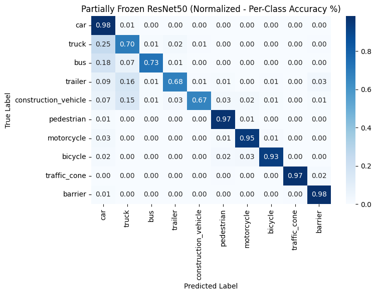
*normalised confusion matrix (per class accuracy) for unfrozen layer 4 + classifer model*

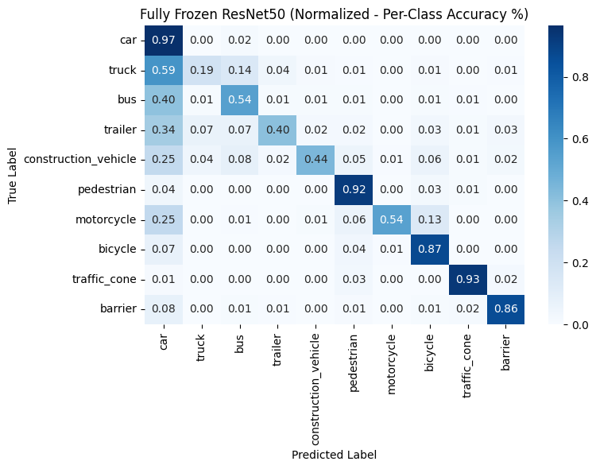
*normalised confusion matrix (per class accuracy) for only classifer unfrozen model*

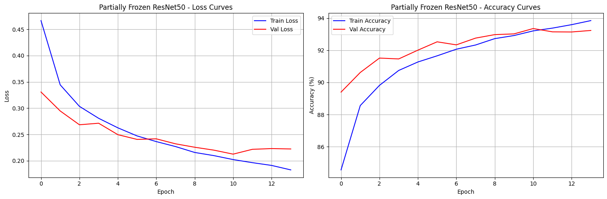
*unfrozen layer 4 + classifer model train and val loss curves*

*only classifer unfrozen model train and val loss curves*

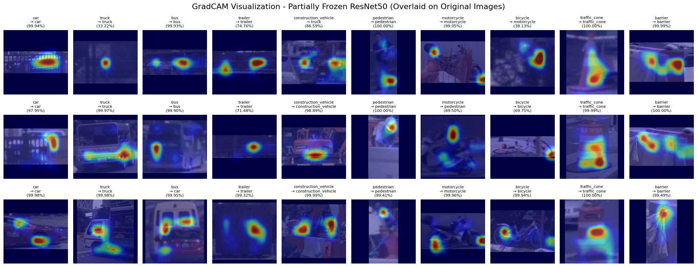
*GradCam attention map for unfrozen layer 4 + classifer model*

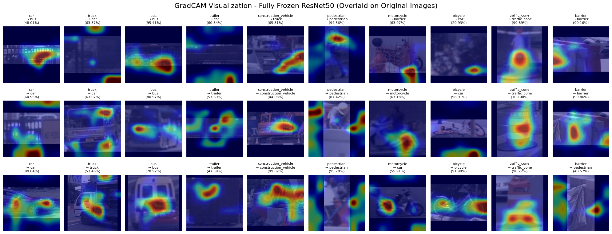
*GradCam attention map for only classifier undrozen*

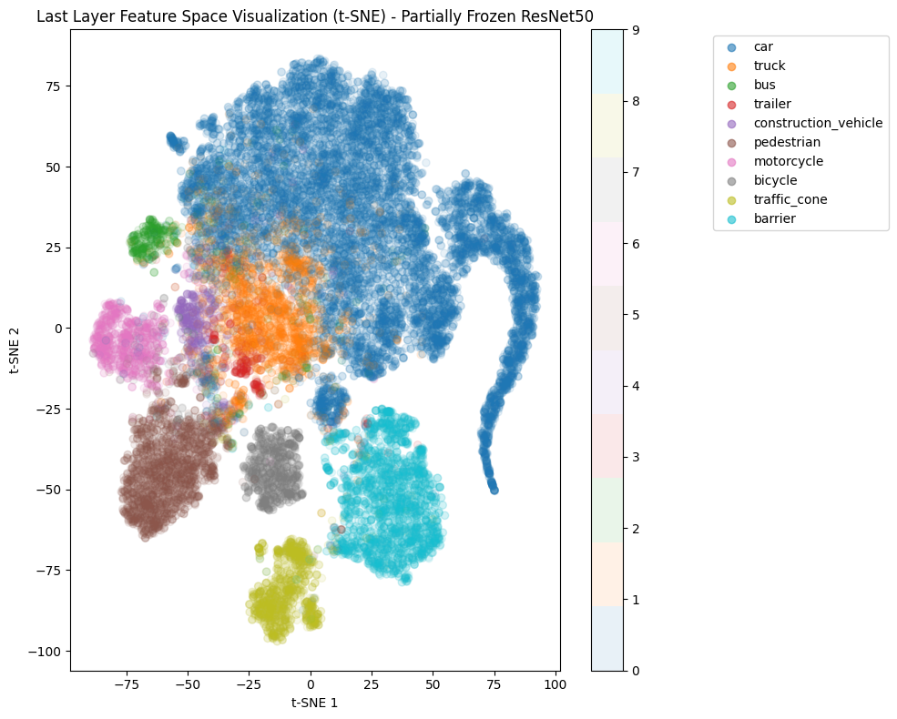
*TSNE Feature Space for unfrozen layer 4 + classifer model*

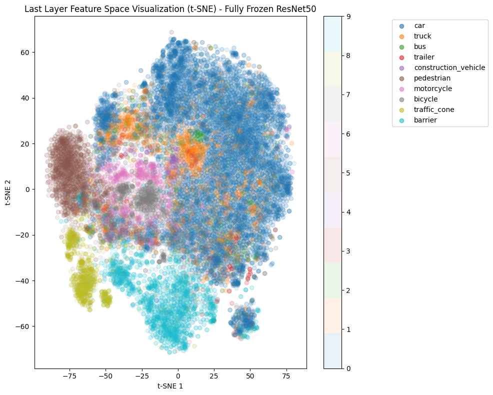
*TSNE Feature Space for only classifier unfrozen model*

### Loss Comparison Study

#### Purpose
This study compares three loss functions (Focal Loss, Cross-Entropy Loss, and Weighted Cross-Entropy Loss) on a custom ResNet architecture to determine optimal handling of class imbalance in NuImages multiclass classification. The goal is to identify which loss function best addresses imbalanced class distributions while maintaining overall classification accuracy.

#### Data Augmentation Pipeline
- Horizontal flip = 0.5
- Vertical flip = 0.5  
- Rotation = 36 degrees
- Random zoom = 0.8 to 1.2x
- Mean normalization

#### Model Architecture
- **Input tensor**: (24, 3, 224, 224), **Output**: 10 classes

**Feature Extractor**:
- Initial conv: 3→64 channels, 7x7 kernel, stride=2, batch norm, ReLU
- 3 residual blocks: 64→64→128→256 channels, kernel=3x3
- Global average pooling (256-dim output)

**Classifier**:
- FC1: 256→512, ReLU, dropout=0.3
- FC2: 512→10 (raw logits)

#### Model Variants
**Model A**: Focal Loss (γ=2.0, α=0.25)  
**Model B**: Cross-Entropy Loss (no weighting)  
**Model C**: Weighted Cross-Entropy Loss (inverse frequency weights)

#### Training Configuration
- **Optimizer**: Adam (lr=0.001)
- **Scheduler**: ReduceLROnPlateau (patience=3, factor=0.5)
- **Early Stopping**: Patience=7 epochs
- **Batch Size**: 24, **Max Epochs**: 40
- **Validation Split**: 20%

#### Evaluation Metrics
- Primary: Validation accuracy
- Secondary: Per-class metrics, confusion matrices, loss convergence comparison

#### Findings

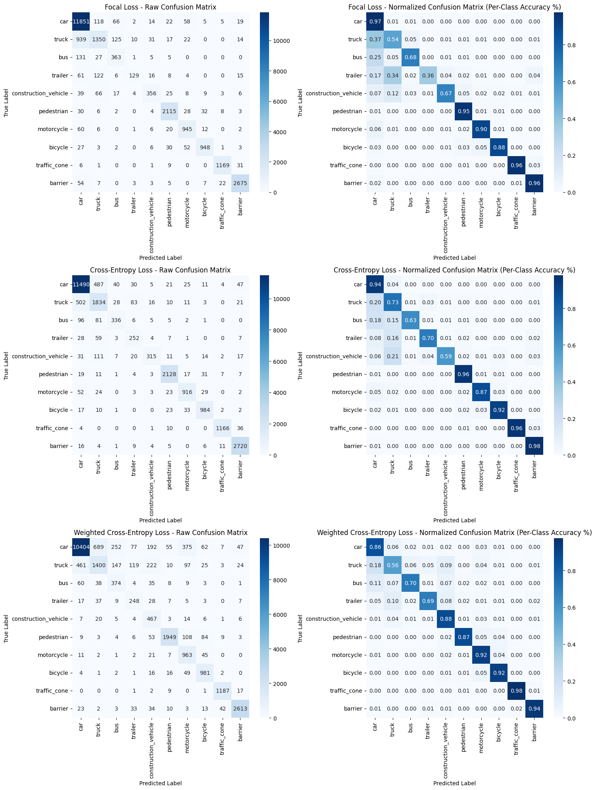
*confusion matrices for all models*

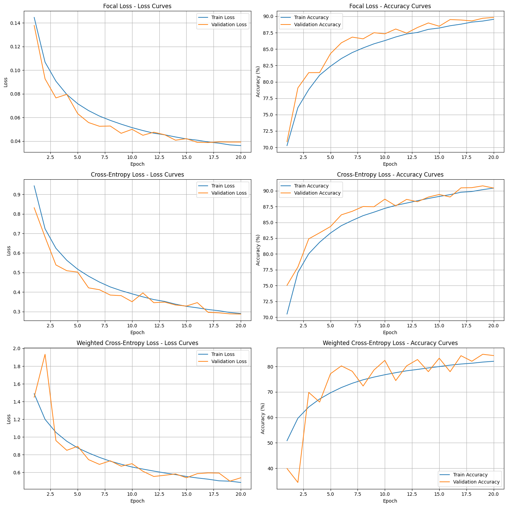
*train val loss & accuracy curves for all models*

*confusion matrices for all models*

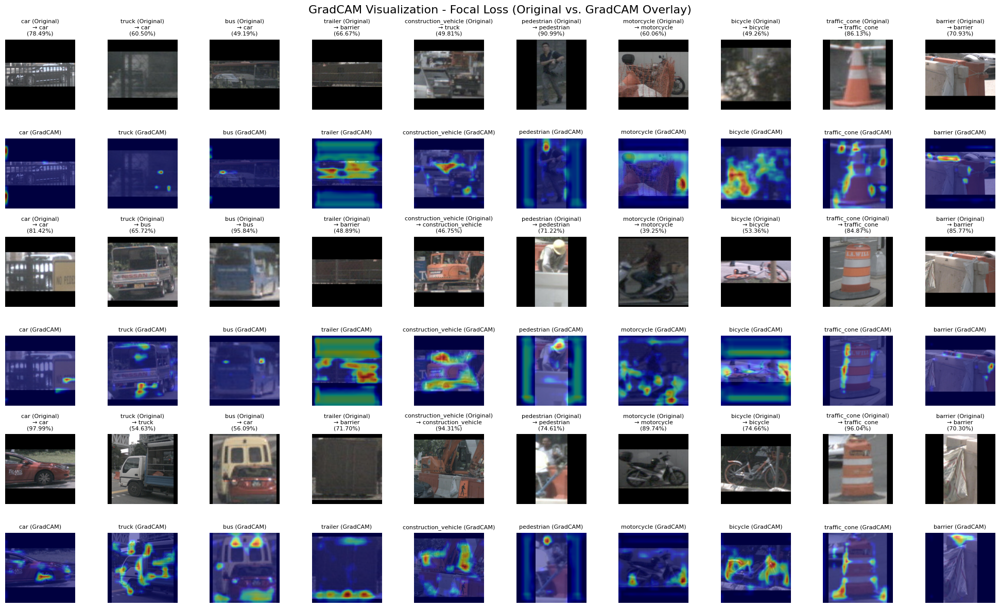
*GradCam for Model A*

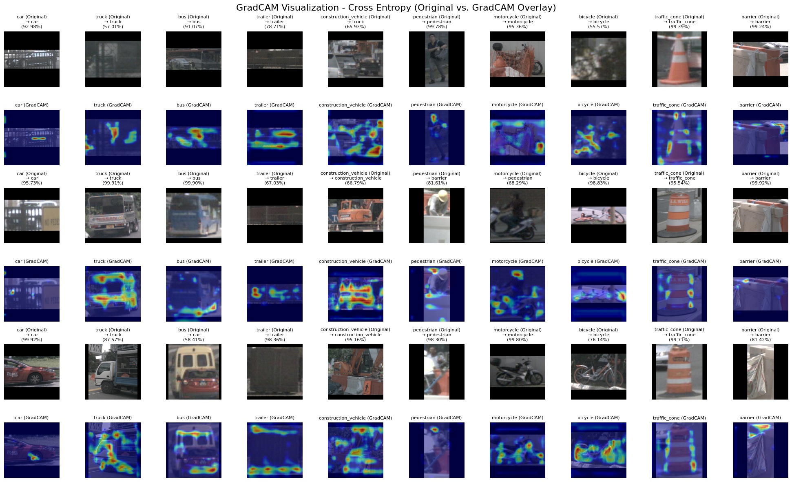
*GradCam for Model B*

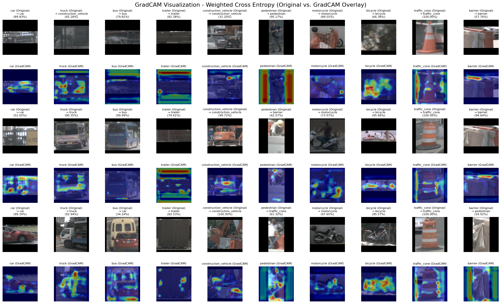
*GradCam for Model C*

*TSNE Feature Space for all models*

## Conclusion
The NuImages dataset demonstrates exceptional quality for multiclass object classification tasks. Although underrepresented classes like trailer, bus and construction vehicles, further regularisation and augmentation may improve the already excellent results (relatively test accuracies, low loss) in our experiments. Going forward, we will be implementing a [Camera Image Labelling Assist Tool](https://huggingface.co/spaces/ImShooShoo/Street-View-Labeling-Assistant).

## Citation
Caesar, H., et al. (2020). nuScenes: A multimodal dataset for autonomous driving. https://arxiv.org/pdf/1903.11027
