# NuImages Multiclass Object Detection & Classification

> A computer vision project for multiclass object understanding on the [NuImages dataset](https://www.nuscenes.org/nuimages). Current focus: high-quality classification crops, full-frame detection, and active-learning powered incremental updates.

---

## Project Overview

NuImages offers street-view images captured across Boston and Singapore—ideal for autonomous driving research. We reduced the original 23 classes to 10 canonical classes to ensure balanced experiments: car, barrier, truck, pedestrian, traffic cone, motorcycle, bicycle, bus, construction vehicle, and trailer. Processed crops, metadata (`manifest.csv`, `classes.json`), and label maps are provided on Kaggle: [Processed NuImages Dataset](https://www.kaggle.com/datasets/ziqiangg/nuimages).

---

## Classification – NuImages Crops

### Dataset & Label Space

We frame the problem as multiclass classification over the 10 canonical categories listed above. Inputs are street-scene crops, each resized to 224×224 before being passed into ResNet-based classifiers. The curated Kaggle release includes ready-to-train splits plus class manifests for downstream reuse.

### Data Preprocessing & Quality Analysis Pipeline

- **Overlap Detection** – Flag same-class overlaps with IoU > 0.15 and cross-class overlaps with IoA > 0.15 to capture duplicates or label bleed.
- **Mislabeling Detection** – Surface heavy overlap between different classes to manually vet potential errors.
- **Distribution Analysis** – Track class balance per camera, plus single vs. grouped instances, to inform augmentation.
- **Issue Buckets** – Tag items as “High IoA different class”, “High IoU”, or “Both issues” for rapid cleaning.

This pipeline keeps the classifier’s training set clean—critical for visually similar objects such as traffic cones vs. barriers.

### Experimentation

Open the notebooks under `/experiments` for the exact training/evaluation scripts described below.

#### Ablation Study

This ablation isolates the ResNet50 feature extractor from the classifier head. By comparing a fully frozen backbone (ImageNet weights) against a partially unfrozen backbone (layer4 + classifier), we quantify the value of feature adaptation for NuImages.

- **Input tensor**: `(batch_size, 3, 224, 224)`
- **Backbone**: ResNet50, ImageNet1K_V1 weights
- **Freezing strategy**: either freeze all layers or unfreeze layer4 + classifier
- **Classifier**: FC layer (2048→10), ~20K trainable params
- **Training**: Adam (lr=0.001), ~25.6M params with only 0.08% trainable in the frozen setup

Findings:

*normalised confusion matrix (per class accuracy) for unfrozen layer 4 + classifier*

*normalised confusion matrix (per class accuracy) for classifier-only fine-tuning*

*unfrozen layer 4 + classifier model: train/val loss*

*classifier-only fine-tuning: train/val loss*

*GradCAM (layer4 + classifier)*

*GradCAM (classifier-only)*

*TSNE feature space (layer4 + classifier)*

*TSNE feature space (classifier-only)*

#### Loss Comparison Study

We compare Focal Loss, Cross-Entropy, and Weighted Cross-Entropy on a lightweight custom ResNet.

- **Augmentation**: horizontal/vertical flip (0.5), rotation 36°, zoom 0.8–1.2×, mean normalization
- **Architecture**: 3 residual blocks (64→256), global average pooling, FC head (256→512→10)
- **Training**: Adam (lr=0.001), ReduceLROnPlateau, early stopping, batch size 24, max 40 epochs

Findings:

*Confusion matrices for all loss functions*

*Train/val loss & accuracy per loss*

*GradCAM – Focal Loss*

*GradCAM – Cross-Entropy*

*GradCAM – Weighted Cross-Entropy*

*TSNE feature space for all models*

### Key Takeaways

NuImages remains a strong benchmark for multiclass object classification, even for underrepresented classes like trailer, bus, and construction vehicles. Regularisation plus augmentation help squeeze a few extra points of accuracy. The next phase scales to full-frame detection and powers our [Camera Image Labelling Assist Tool](https://huggingface.co/spaces/ImShooShoo/Street-View-Labeling-Assistant).

---

## Object Detection – Full-Frame Street Scenes

### Why Detection

Detection complements crop classification by reasoning over entire camera feeds and localising multiple objects per frame. This stage provides richer supervision for the labelling assistant.

### Training Setup (YOLO11n v4)

- **Run**: `runs/20251110_032855__yolo11n__exp_yolo_n_v4`
- **Model**: `yolo11n.pt`, AdamW optimizer, 100 epochs, batch 16, 1280×1280 rectangular dataloader (`runs/20251110_032855__yolo11n__exp_yolo_n_v4/args.yaml`)
- **Dataset**: YOLO-formatted cache at `runs/yolo_ds_cached`, built by `utils/detection/train.py` with COCO→YOLO conversion, symlinked images, and automated metric exports (`utils/detection/train.py:3-200`)
- **Augmentation**: Mosaic/mixup disabled, horizontal flip 0.5, erasing 0.4 (Ultralytics defaults, see `args.yaml`)

### Performance Snapshot

Best checkpoints (epochs 22–40) reach **Precision 0.754**, **Recall 0.607**, **mAP@0.50 0.675**, **mAP@0.50:0.95 0.433** (see `results.csv`). The combined loss/metric plot below also highlights the steady drop in box/class/DFL losses.

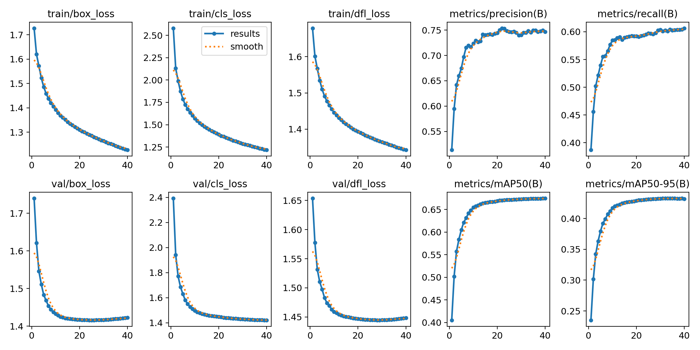
*Box/cls/DFL losses with corresponding precision, recall, and mAP trends for YOLO11n v4*

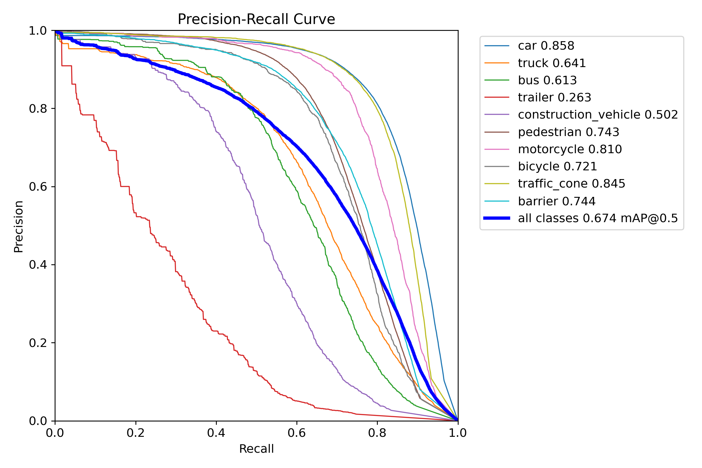
*Precision vs. recall breakdown across IoU thresholds on the validation set*

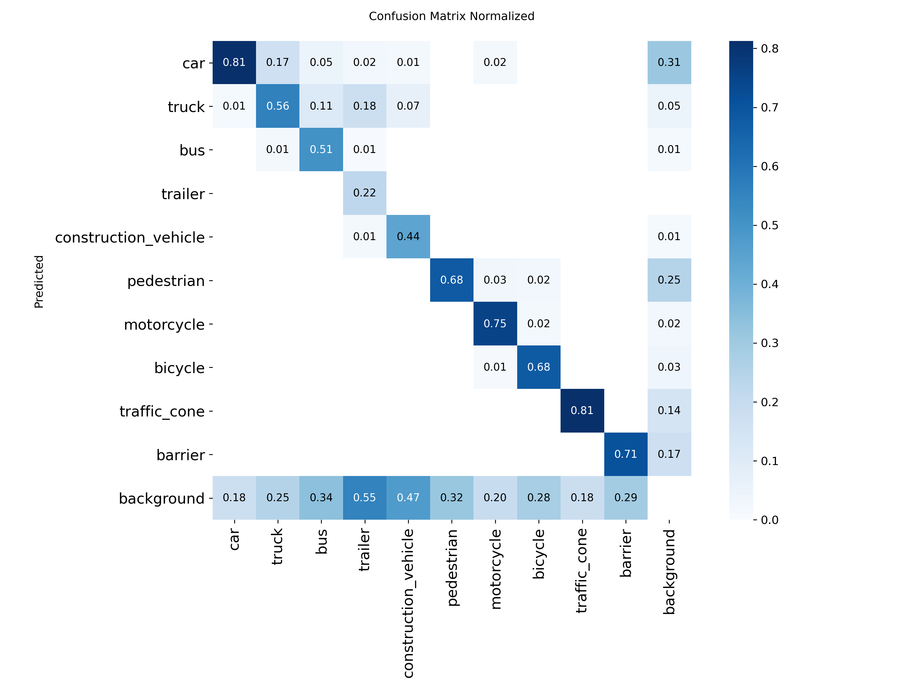
*Per-class normalised confusion matrix showing strongest classes (cars, trucks) and current weak spots (trailers, construction vehicles)*

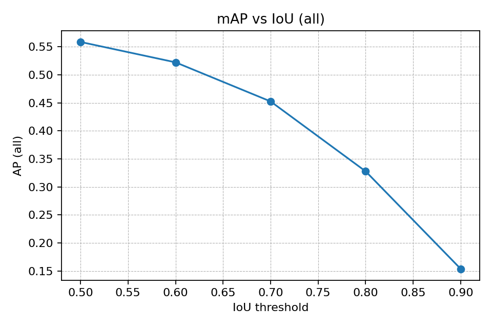
*mAP as IoU varies from 0.5 to 0.95, clarifying performance drop-off on stricter localisation requirements*

### Qualitative Validation Samples

Side-by-side comparisons of predicted vs. ground-truth boxes highlight model strengths and remaining misses.

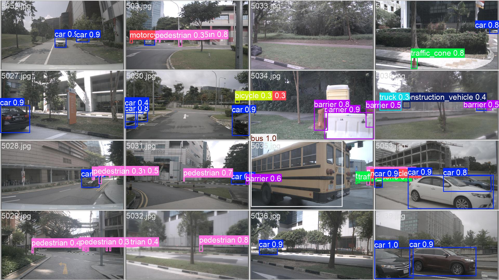
*YOLO11n predictions on a random validation batch (epoch ~30)*

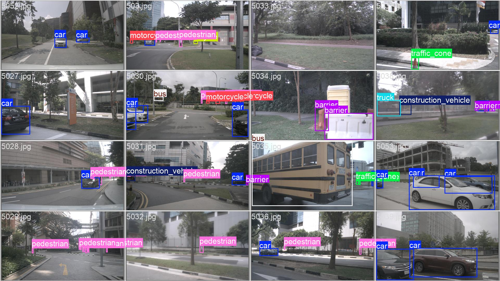
*Ground-truth annotations for the same batch*

---

## Active Learning & Incremental Updates

### Dataset Assembly

- **Phase A (new-only)** – `meta/al/datasets/inc_traffic_light_newonly/stats.json` supplies 106 train / 45 val frames containing only the new `traffic_light` class (353 / 135 boxes). This set bootstraps the Phase-A head without touching legacy categories.
- **Phase B (fused)** – `meta/al/datasets/inc_traffic_light/stats.json` grows the corpus to 378 train / 273 val frames once exemplars and teacher pseudo-labels are merged. Legacy coverage jumps to 6,742 train and 6,049 val boxes, e.g. cars 1,580 train, pedestrians 1,515, traffic_cone 719, while the new class still contributes 353/135 boxes.

### Phase Outcomes (`inc_summary.json`)

| Phase | Description | Best mAP@0.50:0.95 | Precision | Recall | Notes |
|------|-------------|-------------------|-----------|--------|-------|
| A | New-class warm-up with old-teacher pseudo labels | **0.25** | 0.84 | 0.89 | Head-only training stabilises `traffic_light` before mixing exemplars. |
| B1 | Frozen fusion (dual teachers + GT exemplars) | **0.31** | 0.64 | 0.54 | Highest overall mAP; exemplar val split keeps both old & new classes in view. |
| B2a | Unfreeze tail block + calibration | **0.28** | 0.61 | 0.51 | Slight mAP drop after unfreezing, but best weights from this phase are deployed. |

Phase-B confidence sweeps peak near **conf = 0.20** (precision 0.59 / recall 0.55 / F1 0.57), which is the threshold used inside the labelling assistant.

### Fusion Results (Phase B2a)

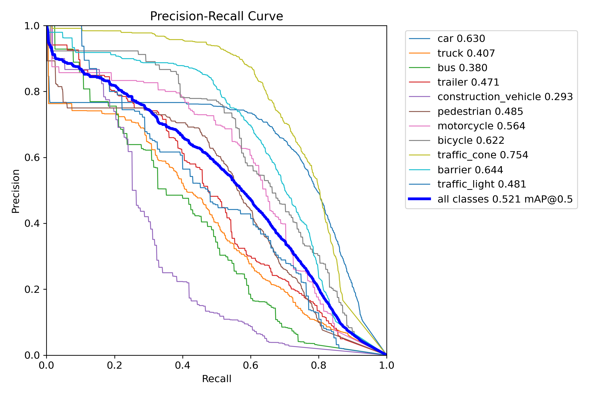
*Precision/recall sweep for the fused detector; new-class precision stays >0.6 at practical thresholds.*

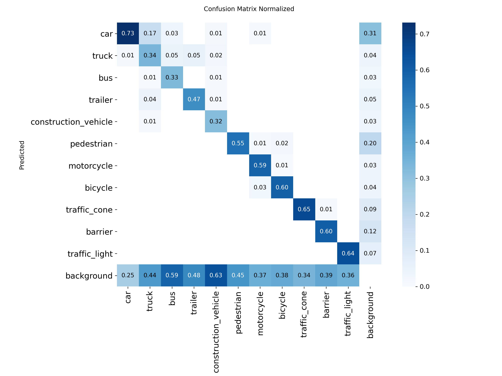
*Legacy classes (cars, pedestrians, barriers) remain stable while `traffic_light` joins the label set.*

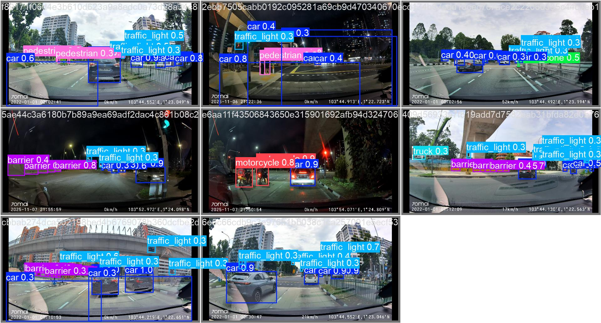
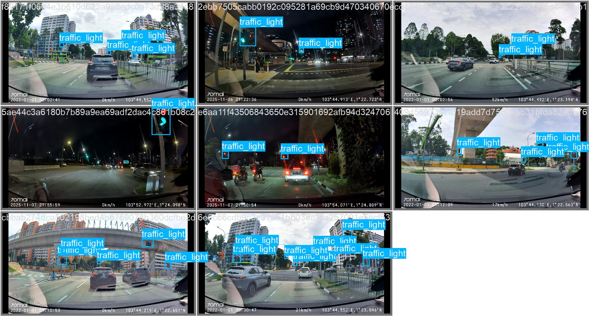
*Two-teacher fusion results on a validation batch versus the original GT labels (notice correctly recovered lights near intersections).*

### Incremental Crop Classifier (ConvNeXt-Tiny KD)

A ConvNeXt-Tiny head is expanded to include `traffic_light`, mirroring the detector’s class set. Training details live in `runs/20251122_154701__convnext_tiny__cls_inc_kd_v1/config.resolved.json`:

- Stage A: freeze backbone, train classifier head for 5 epochs (AdamW lr=5e-4, inverse-frequency CE).
- Stage B: unfreeze the last ConvNeXt block + classifier (dual LR param groups, focal loss with effective-number weights). Strong flips/rotations/scales at 224×224 ensure balanced augmentation.

Performance (`test_metrics.json`):

- **Val** – loss 0.266 · acc 83.2% · macro-F1 0.824  
- **Test** – loss 0.202 · acc 84.6% · macro-F1 0.838

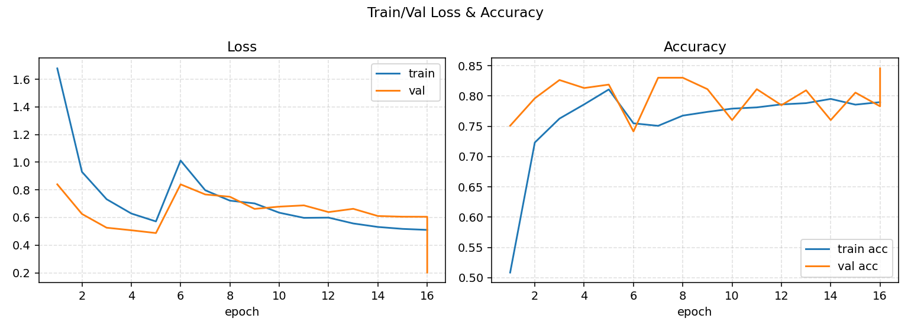
*Stage A/B loss and macro-F1 curves showing fast convergence after adding the new head.*

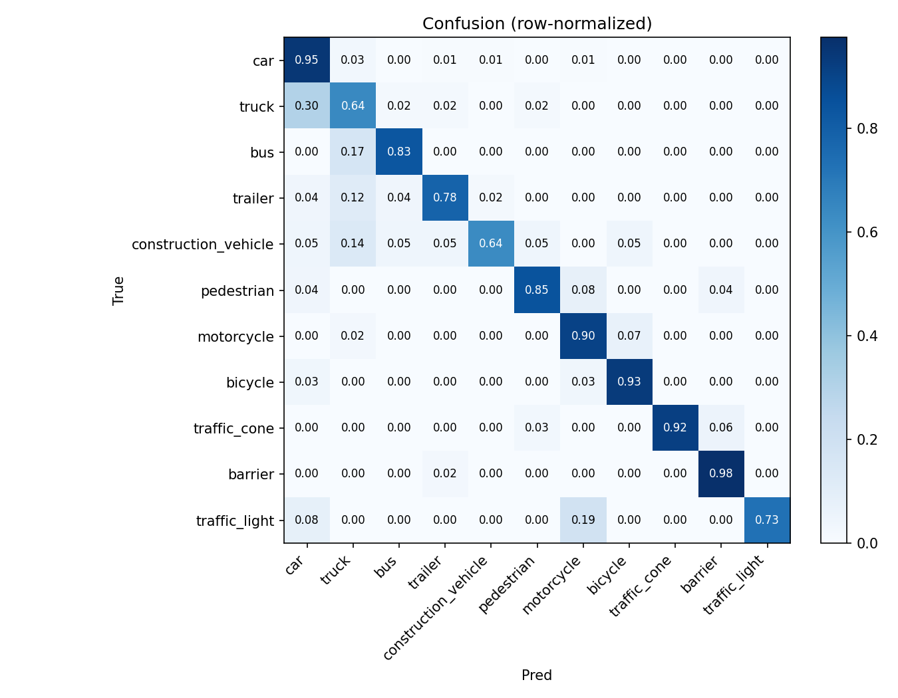
*Row-normalized confusion on the held-out test split; legacy classes maintain balance while `traffic_light` slots in without catastrophic forgetting.*

Together, the Phase-B2a detector and ConvNeXt classifier confirm that the active-learning loop can add new classes while keeping previously learned categories intact.

---

## Citation

Caesar, H., et al. (2020). nuScenes: A multimodal dataset for autonomous driving. https://arxiv.org/pdf/1903.11027
